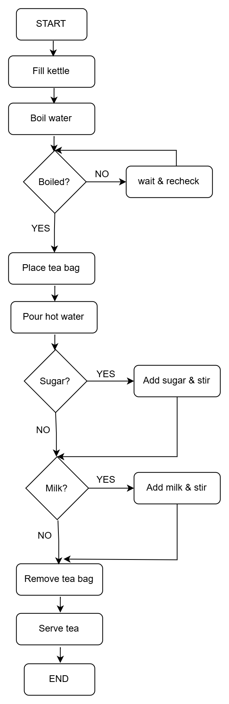

# Algorithm & Flowchart — Everyday Task

**Task chosen:** Making a cup of tea
**Why I chose it:** It has clear steps, a decision point, and a visible output.

---

## 🧾 Algorithm (Step-by-Step)

1. **START**
2. Fill the kettle with water
3. Boil the water
4. **DECISION:** Is the water boiled?
   - If **NO** → wait and check again (go back to step 3)
   - If **YES** → continue to step 5
5. Place a tea bag in a cup
6. Pour the hot water into the cup
7. **DECISION:** Do you want sugar?
   - If **YES** → add sugar and stir
   - If **NO** → skip to step 8
8. **DECISION:** Do you want milk?
   - If **YES** → add milk and stir
   - If **NO** → skip to step 9
9. Remove the tea bag
10. Serve the tea
11. **END**

---

## 🔀 Flowchart

---

## 🧠 What This Taught Me

- **Input:** water, tea bag, sugar, milk
- **Process:** boiling, pouring, stirring
- **Output:** a cup of tea
- **Decisions:** sugar? milk? — these map to Python `if/else` statements
- **Repetition:** waiting for water to boil maps to a `while` loop

This is exactly how programs work — input, process, output, with decisions and loops.

---

## 🔁 Mapping to Python (Preview)

| Algorithm step | Python concept |
|----------------|----------------|
| Boil water | A function call: `boil_water()` |
| Is water boiled? | `if is_boiled:` |
| Wait and recheck | `while not is_boiled:` |
| Add sugar? | `if wants_sugar:` |
| Serve tea | `print("Tea is ready!")` |

I'll learn all of these over the next few weeks.